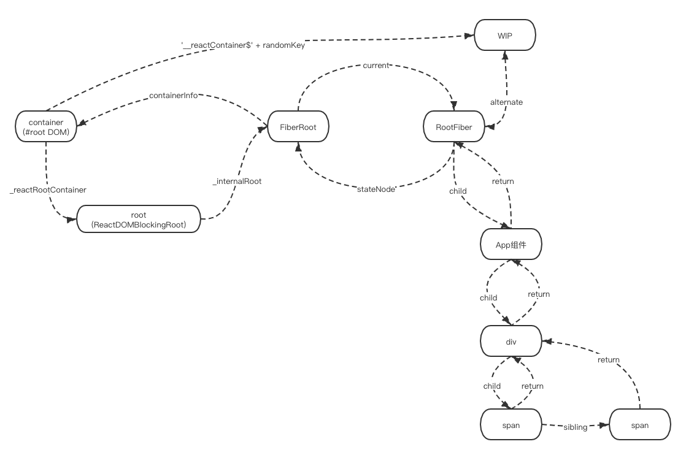

## render

```jsx
ReactDOM.render(<App/>, document.getElementById('root'))
```
这句代码通常作为 `React` 应用的入口，将组件挂载到实际的 `DOM` 元素内


## FiberRoot 与 RootFiber
`FiberRoot`：由挂载容器 (DOM 元素) 生成的一个对象
`RootFiber` ：`Fiber` 树的顶层结点

### 创建 FiberRoot

```js
// packages/react-reconciler/src/ReactFiberRoot.old.js#L59-L87

export function createFiberRoot(
  containerInfo: any,
  tag: RootTag, // Legacy、Blocking、Concurrent 三种模式
  hydrate: boolean,
  hydrationCallbacks: null | SuspenseHydrationCallbacks,
): FiberRoot {
  // 通过 FiberRootNode 构造函数创建 FiberRoot
  const root: FiberRoot = (new FiberRootNode(containerInfo, tag, hydrate): any);
  if (enableSuspenseCallback) {
    root.hydrationCallbacks = hydrationCallbacks;
  }

  // Cyclic construction. This cheats the type system right now because
  // stateNode is any.
  // 创建一个 RootFiber，和 FiberRoot 相互引用
  /**
   *           ---- current --->
   *  FiberRoot                  RootFiber
   *           <---- stateNode --
   */
  const uninitializedFiber = createHostRootFiber(tag);
  root.current = uninitializedFiber;
  uninitializedFiber.stateNode = root;

  // 初始化一个更新队列对象 `queue`，赋值给 fiber 的 updateQueue 属性
  initializeUpdateQueue(uninitializedFiber);

  return root;
}
```

### 创建 Fiber
```ts
// packages/react-reconciler/src/ReactFiber.js

type Fiber = {
  // Tag identifying the type of fiber.
  // fiber类型：FunctionComponent、ClassComponent....
  tag: WorkTag,

  // Unique identifier of this child.
  key: null | string,

  // The value of element.type which is used to preserve the identity during
  // reconciliation of this child.
  // ReactElement.type，也就是我们调用`createElement`的第一个参数
  elementType: any,

  // The resolved function/class/ associated with this fiber.
  type: any,

  // The local state associated with this fiber.
  // RootFiber.stateNode => FiberRoot
  // 其余 Fiber 的 stateNode 一般指向真实 DOM 元素
  stateNode: any,

  // Conceptual aliases
  // parent : Instance -> return The parent happens to be the same as the
  // return fiber since we've merged the fiber and instance.

  // Remaining fields belong to Fiber

  // The Fiber to return to after finishing processing this one.
  // This is effectively the parent, but there can be multiple parents (two)
  // so this is only the parent of the thing we're currently processing.
  // It is conceptually the same as the return address of a stack frame.
  return: Fiber | null,

  // Singly Linked List Tree Structure.
  child: Fiber | null,
  sibling: Fiber | null,
  index: number,

  // The ref last used to attach this node.
  // I'll avoid adding an owner field for prod and model that as functions.
  ref:
    | null
    | (((handle: mixed) => void) & {_stringRef: ?string, ...})
    | RefObject,

  // Input is the data coming into process this fiber. Arguments. Props.
  pendingProps: any, // This type will be more specific once we overload the tag.
  memoizedProps: any, // The props used to create the output.

  // A queue of state updates and callbacks.
  updateQueue: UpdateQueue<any> | null,

  // The state used to create the output
  memoizedState: any,

  // Dependencies (contexts, events) for this fiber, if it has any
  dependencies: Dependencies | null,

  // Bitfield that describes properties about the fiber and its subtree. E.g.
  // the ConcurrentMode flag indicates whether the subtree should be async-by-
  // default. When a fiber is created, it inherits the mode of its
  // parent. Additional flags can be set at creation time, but after that the
  // value should remain unchanged throughout the fiber's lifetime, particularly
  // before its child fibers are created.
  mode: TypeOfMode,

  // Effect
  // 保存本次更新会造成的DOM操作
  effectTag: SideEffectTag,

  // Singly linked list fast path to the next fiber with side-effects.
  nextEffect: Fiber | null,

  // The first and last fiber with side-effect within this subtree. This allows
  // us to reuse a slice of the linked list when we reuse the work done within
  // this fiber.
  // 以当前 fiber 为起点的子树中的第一个/最后一个带有副作用（effectTag）的 fiber 结点，中间的结点用 nextEffect 连接
  firstEffect: Fiber | null,
  lastEffect: Fiber | null,

  // Represents a time in the future by which this work should be completed.
  // Does not include work found in its subtree.
  expirationTime: ExpirationTime,

  // This is used to quickly determine if a subtree has no pending changes.
  childExpirationTime: ExpirationTime,

  // This is a pooled version of a Fiber. Every fiber that gets updated will
  // eventually have a pair. There are cases when we can clean up pairs to save
  // memory if we need to.
  alternate: Fiber | null,
}
```

## fiber 树



## 第一次 render 流程

```js
// packages/react-dom/src/client/ReactDOMLegacy.js
render =>

// packages/react-reconciler/src/ReactFiberReconciler.js
updateContainer => 

// packages/react-reconciler/src/ReactFiberWorkLoop.js
scheduleWork (scheduleUpdateOnFiber) => performSyncWorkOnRoot

performSyncWorkOnRoot => workLoopSync ( => performUnitOfWork => 
// packages/react-reconciler/src/ReactFiberBeginWork.js
(beginWork => update**Component => reconcileChildren => mountChildFibers / reconcileChildFibers) -> completeUnitOfWork )

// packages/react-reconciler/src/ReactFiberWorkLoop.js
performSyncWorkOnRoot => finishSyncRender => commitRoot => commitRootImpl => commitMutationEffects => 

// packages/react-reconciler/src/ReactFiberCommitWork.js
commitPlacement => insertOrAppendPlacementNodeIntoContainer => 

// packages/react-dom/src/client/ReactDOMHostConfig.js
appendChildToContainer
```
生命周期函数在 `commitRootImpl` 中被调用

### ReactElement

```ts
type ReactElement = {|
  $$typeof: any,
  type: any,
  key: any,
  ref: any,
  props: any,
  // ReactFiber: 记录负责创建此元素的组件
  _owner: any,

  // __DEV__
  _store: {validated: boolean, ...},
  _self: React$Element<any>,
  _shadowChildren: any,
  _source: Source,
|};
```
